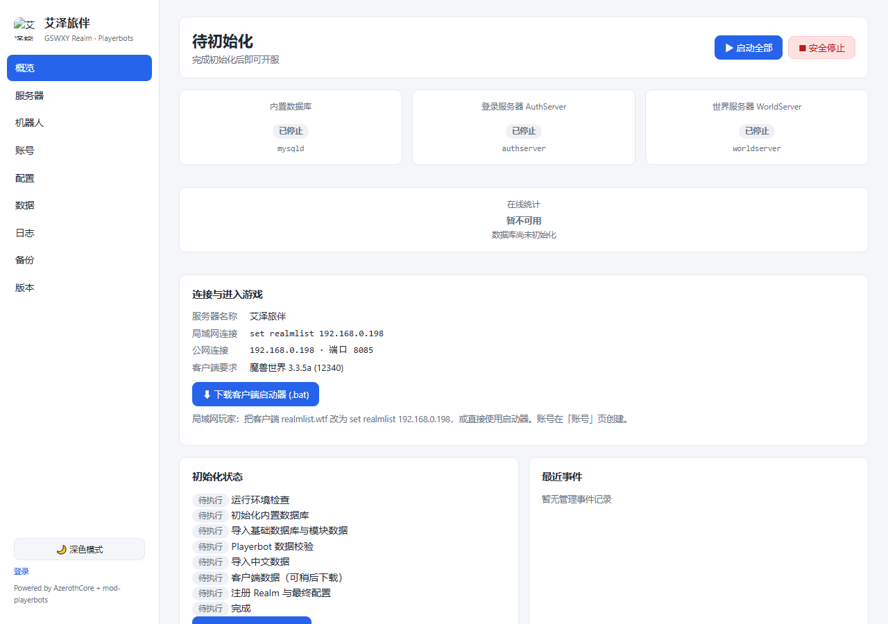
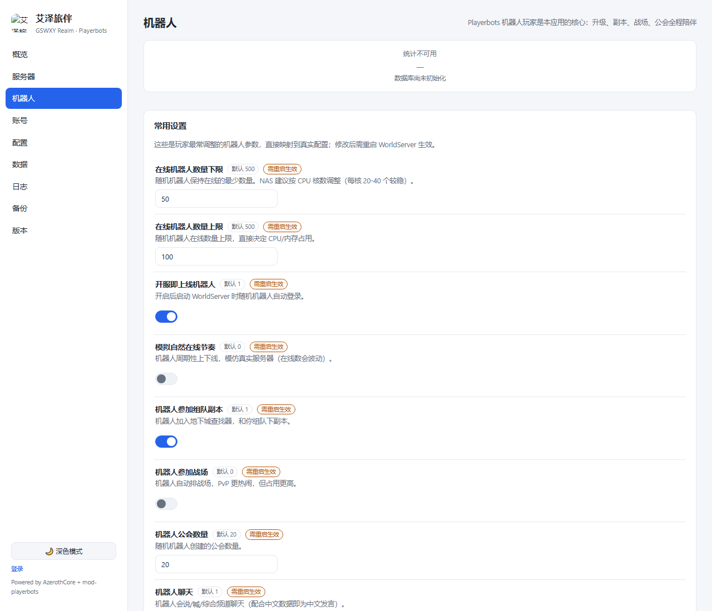
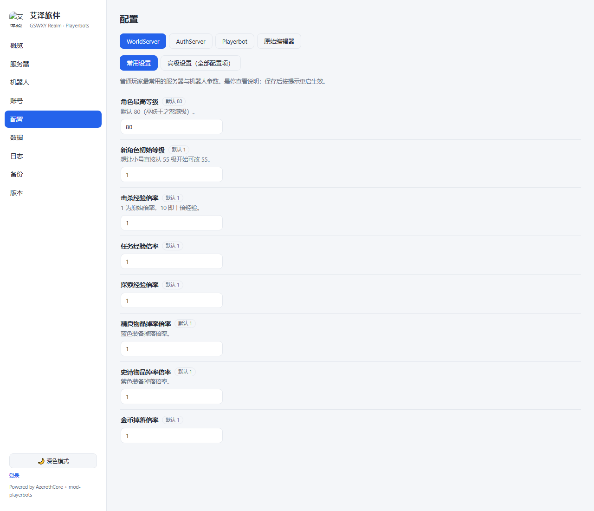
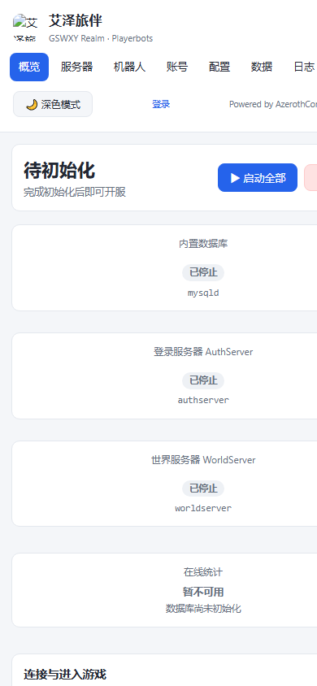

# 艾泽旅伴 · GSWXY Realm

> **fnOS 原生《魔兽世界》3.3.5a 服务器发行版**（AzerothCore + mod-playerbots）
> 安装即可开服：不需要 Docker、不需要 SSH、不需要编译、不需要安装 MySQL、不需要提取地图。

[](https://github.com/gswxy/GSWXY-Realm/actions/workflows/ci.yml)
[](https://github.com/gswxy/GSWXY-Realm/actions/workflows/build.yml)

## 这是什么

艾泽旅伴是一个 fnOS 应用（`.fpk` 安装包）。安装完成后你会得到：

- 一台开箱即用的魔兽 3.3.5a 服务端（AzerothCore + mod-playerbots，版本锁定、可复现构建）
- **机器人玩家（Playerbots）**：升级、副本、战场、公会全程陪你玩，五种玩法模板一键切换
- 全中文世界：NPC / 物品 / 任务 / 广播文本 / 机器人名字，内置 zhCN 数据包
- 中文 Web 管理界面：概览 / 服务器 / 机器人 / 账号 / 配置 / 数据 / 日志 / 备份 / 版本
- 内置数据库运行环境（MySQL Community 8.0，仅监听本机，随机凭据，零配置）

`Powered by AzerothCore + mod-playerbots` · 本项目为社区第三方发行版，与暴雪娱乐无关。

## 界面预览

| 概览（开服控制台） | 机器人（模板与常用设置） |
| --- | --- |
|  |  |

| 配置中心（常用/高级/原始三层） | 手机窄屏自适应 |
| --- | --- |
|  |  |

> 截图为开发模式下的真实界面；安装完成、服务启动后，各页会显示实时状态与统计。

## 系统要求

| 项目 | 要求 |
| --- | --- |
| 系统 | fnOS ≥ 0.9.25，**仅 x86_64**（ARM 不支持） |
| CPU | 4 核起（机器人数量与 CPU 强度直接相关，见下） |
| 内存 | 建议 ≥ 4 GB 可用（含 MySQL 与机器人开销，估算值） |
| 磁盘 | FPK 约 0.4 GB；客户端数据解压约 4 GB；建议保留 ≥ 10 GB 可用 |
| 客户端 | 魔兽世界 3.3.5a（build 12340）任意语言版本 |
| 网络 | 局域网开服无需公网；公网开服需放行 3724 / 8085（TCP） |

> CPU / 内存为估算值（默认 50–100 个机器人规模）；实际占用随机器人数量、地图负载变化，「服务器」页自检与「日志」页可观察。

## 下载与安装

1. 在 [Releases](https://github.com/gswxy/GSWXY-Realm/releases) 下载 `GSWXY-Realm-*-x86_64.fpk`（同目录 `.sha256` 可校验完整性：`sha256sum -c *.sha256`）
2. fnOS 桌面 → 应用中心 → 右上角 **手动安装** → 选择该文件
3. 按安装向导填写：**服务器名称、管理界面密码（≥8 位）、初始机器人数量（10–500）**——这三项会直接生效，无需再设置
4. 打开「艾泽旅伴」→ 用刚才的管理密码登录 → 点「开始初始化」

初始化自动完成（可中断、可续跑，进度落盘）：环境检查 → 内置数据库初始化 → 基础数据库与模块数据导入 → 机器人数据校验 → 中文数据导入 → Realm 注册。客户端数据（约 1.1 GB）可以稍后在「数据」页下载，**在它完成之前数据库显示"初始化完成"≠ 可以进游戏**——启动 WorldServer 需要这些数据。

图文步骤详见 [docs/部署指南.md](docs/部署指南.md)。

## 下载线路与国内网络

**客户端数据（1.1 GB Data.zip）**：

- **自动选择（推荐）**：并行实测官方 GitHub 与各镜像线路（真实拉取文件头部字节判断，不凭域名猜速度），按实测结果排序下载——国内网络不会卡死在无法访问的官方源
- 也可在「数据」页手动指定：官方 GitHub 直连 / 单条镜像线路
- 每条线路带连接超时、无数据传输超时（30 秒）、断点续传与自动换源；HTML 错误页、文件长度不符、Content-Range 异常、SHA-256 不匹配都会被识别并换线，损坏文件不缓存复用
- 跨线路不续传：换线路时若无法确认内容一致会从头下载，避免不同来源的数据错误拼接；用户主动取消则保留断点，同线路重试可续传
- 镜像线路集中配置在 `resources/mirrors.json`（全部 https，失效自动跳过，便于以后更新）

**FPK 安装包**：GitHub Releases 为原始发布来源。「版本」页检查更新时会同时**实测**国内加速线路——只有 HEAD 校验确认文件存在且大小与官方资产完全一致，才显示「国内下载」按钮；未验证通过绝不显示假按钮。两个来源的文件与对应 Release 一致，安装仍一律通过 fnOS 应用中心。

**SHA-256 校验**：每个 Release 附带 `.fpk.sha256`。Windows：`certutil -hashfile GSWXY-Realm-x.y.z-x86_64.fpk SHA256` 后与 `.sha256` 内容比对；Linux/macOS：`sha256sum -c *.sha256`。

**镜像全部不可用时**：在任何电脑下载官方 [Data.zip（client-data v20.0）](https://github.com/wowgaming/client-data/releases)→ 放入 NAS 应用数据目录的 `downloads/manual/` 文件夹 → 「数据」页点「扫描并导入」。导入与网络下载使用完全相同的完整性校验（大小 + SHA-256），不会因 GitHub 不可达而无法初始化服务器。

## 服务端 enUS DBC 说明（重要）

> **服务端使用 AzerothCore 兼容的 enUS DBC，这是服务端运行数据要求，与玩家使用中文客户端并不冲突。本发行版的中文化由数据库本地化等机制提供。请勿将中文客户端中的 zhCN DBC 直接覆盖服务端 DBC。**

面向普通用户的解释：

- DBC 是服务端读取游戏基础数据（技能、物品属性、地图信息等）的文件，与客户端界面语言是两回事
- 官方 Client Data v20 数据包即 enUS 版，随本发行版版本锁定（大小 + SHA-256 固定）；校验吻合即官方原包。无法逐文件判断 DBC 语言时以锁定哈希为准，不伪造"enUS 校验通过"
- 玩家客户端：中文 3.3.5a 客户端照常连接游玩，游戏内中文来自数据库中文化数据与账号 locale 设置
- maps / vmaps / mmaps / Cameras 等其他服务端数据随官方包一并提供，按上游兼容要求使用，无需任何"翻译"或改动

## 进入游戏

1. 「账号」页创建账号（可选 GM 等级 0–3，随时可改）
2. 客户端连接二选一：
   - **推荐**：「概览 / 服务器」页下载 **启动器 .bat**，放进魔兽客户端文件夹双击，自动改 realmlist 并启动游戏
   - 手动：客户端 `Data\zhCN\realmlist.wtf`（按客户端语言目录）改为 `set realmlist <NAS 的 IP>`
3. 登录服务器选择「艾泽旅伴」（你设置的名称），用创建的账号进入

局域网玩家用 NAS 内网 IP；公网玩家需在路由器放行 3724/8085 并在「服务器」页填写公网地址。查看 NAS IP：fnOS 桌面设置或路由器后台；「服务器」页也会自动检测当前地址。**管理界面（18700）不建议暴露公网。**

## 机器人（Playerbots）玩法

「机器人」页提供五种配置模板，全部映射到真实的上游配置（无虚构开关）：

| 模板 | 机器人数量 | 特点 | 负载 |
| --- | --- | --- | --- |
| 自然世界 | 30–60 | 周期性上下线，模拟真实服务器节奏 | 低 |
| 单人陪玩 | 40–80 | 自动做任务/学技能/换装备，随时组队 | 低-中 |
| 副本优先 | 80–150 | 积极加入地下城查找器（LFG） | 中-高 |
| PvP 活跃 | 60–120 | 自动排战场（含奥山）与竞技场 | 中-高 |
| 低性能 | 10–20 | 放慢 AI 节奏、关闭社交行为 | 最低 |

- 应用模板前可展开查看 **全部** 变更明细；应用后按提示重启 WorldServer 生效
- 「常用设置」可直接调整在线数量、战场/副本/公会/聊天等参数
- 统计页统一口径：真实玩家 vs 机器人（在线与全量分开），联盟/部落/职业/等级分布
- 机器人说中文的条件与上游一致：账号 locale 为 zhCN（本应用创建的账号已自动设置）

**机器人数量与设备性能**：每核 20–40 个在线机器人为较稳区间（估算值，随地图负载浮动）。默认 50–100 适合 4 核；NAS 负载高时切换「低性能」模板或在「常用设置」减少数量。

## 配置中心

三级配置模型，升级不丢用户设置：

1. **上游默认**：来自锁定的 `worldserver.conf.dist` / `authserver.conf.dist` / `playerbots.conf.dist`
2. **GSWXY 推荐**：内置推荐值（安全基线与合理默认）
3. **用户覆盖**：你在 WebUI 改的值

三种使用方式：**常用设置**（十余个高频参数，开关/数字控件）、**高级设置**（全部 1500+ 配置项，真实分组 + 中文说明 + 搜索 + 三层值展示 + 还原默认）、**原始编辑器**（直接编辑用户层文本）。服务端同样做类型校验；数据库连接串等敏感项由系统注入，不受编辑器影响。

## 数据、备份与升级

```
var/                        （fnOS @appdata，升级/卸载默认保留）
├── mysql/                  MySQL 数据目录（账号、角色、机器人数据）
├── client-data/            dbc / maps / vmaps / mmaps / Cameras
├── config/                 用户配置（三层模型中的用户层）
├── backups/                备份档案（tar.gz + manifest）
├── downloads/manual/       NAS 本地导入 Data.zip 的投放目录
├── logs/                   Manager / 审计 / 升级日志
└── state/                  初始化状态、数据库凭据（0600）
```

- **备份包含**：账号库、角色库、机器人库（playerbots，完整）、世界库中文化相关表、用户配置与状态；不含可重新下载的客户端数据。支持每日自动备份（保留 30 份且总量上限 24 GB）
- **恢复**：恢复前自动再备份当前状态、自动停止游戏服务器、校验备份完整性与版本兼容；跨机器恢复会保留本机数据库端口等环境差异项
- **升级**：fnOS 应用中心直接安装新 FPK 覆盖；数据库、账号、角色、机器人、配置、备份、客户端数据全部保留。详见 [docs/升级指南.md](docs/升级指南.md)
- **卸载**：默认保留全部数据；仅当你在卸载向导中明确选择"删除所有数据"才会清除
- 「版本」页可在线检查 GitHub 更新（稳定/测试通道），只读不自动安装

更多见 [docs/备份恢复.md](docs/备份恢复.md) 与 [docs/常见问题.md](docs/常见问题.md)。

## 端口

| 端口 | 用途 | 暴露范围 |
| --- | --- | --- |
| 18700 | Web 管理界面（fnOS 桌面图标打开） | 建议仅局域网 |
| 3724 | 登录服务器（客户端 realmlist） | 局域网 / 按需公网 |
| 8085 | 世界服务器（游戏流量） | 局域网 / 按需公网 |
| 随机高位 | 内置 MySQL（仅 127.0.0.1） | 不暴露 |

## 开发与构建

```bash
bash scripts/fetch-upstream.sh build/src      # 按版本锁拉取上游（精确 SHA）
bash scripts/build-core.sh                    # CMake + Ninja 编译 Core + Playerbots（需 gcc-13）
bash scripts/build-manager.sh                 # Go 构建 Manager
python3 config-schema/generator/generate.py --src build/src \
  --out config-schema/generated/config-schema.json \
  --out-zh config-schema/generated/config-schema.zh.json \
  --translations config-schema/translations/zhCN.json
bash scripts/collect-runtime.sh               # 组装 fnOS payload（含 MySQL 8 运行时）
bash scripts/gen-build-info.sh                # 生成 build-info.json（版本唯一来源：fnos/manifest）
bash scripts/smoke-test.sh                    # 冒烟测试 + 配置键防回归
bash scripts/build-fpk.sh                     # fnpack 打包 .fpk
bash scripts/verify-package.sh                # 结构与版本一致性验证
python resources/icon/build_icon.py           # 重新生成图标 SVG（改图标时）
```

构建基线 ubuntu-22.04 + gcc-13；数据库运行时为 MySQL 8.0.46（minimal，glibc2.17），**不能用 MariaDB 替代**（mod-playerbots 核心按版本字符串比较会拒绝）。

| Workflow | 触发 | 作用 |
| --- | --- | --- |
| `ci.yml` | push / PR | Manager 单测 + race、WebUI 检查、schema 生成测试、locale 校验、shellcheck、FPK 静态验证 |
| `build.yml` | 关键路径变更 / 手动 | 全量编译 + FPK Artifact（版本 = manifest + nightly 序号） |
| `release.yml` | 手动（版本号 + 通道） | 版本一致性守卫 + 编译 + 发布 Release |
| `upstream-check.yml` | 每日 | 上游 SHA 变化 → 开 Issue（不自动进 Stable） |

上游版本锁定在 [`versions/upstream.json`](versions/upstream.json)，任何正式 Release 都可据此精确复现。

## 致谢与许可

- [AzerothCore](https://github.com/azerothcore/azerothcore-wotlk) 与 [mod-playerbots](https://github.com/mod-playerbots/mod-playerbots)（AGPL-3.0）——本项目的核心，Playerbot 分支由 mod-playerbots 社区维护
- [wowgaming/client-data](https://github.com/wowgaming/client-data) —— 客户端数据（用户端下载）
- MySQL Community Server（GPL-2.0 with FOSS exception，内置运行时）
- 艾泽旅伴自有代码：AGPL-3.0（见 [LICENSE](LICENSE)）；第三方清单见发布资产 `THIRD-PARTY-LICENSES.txt`

本仓库不包含、不分发任何暴雪客户端原始资产；客户端数据（DBC/Maps/...）由用户端从官方发布页下载。本项目为非官方社区发行版，与暴雪娱乐无关，"魔兽世界"及相关名称归暴雪娱乐所有。
